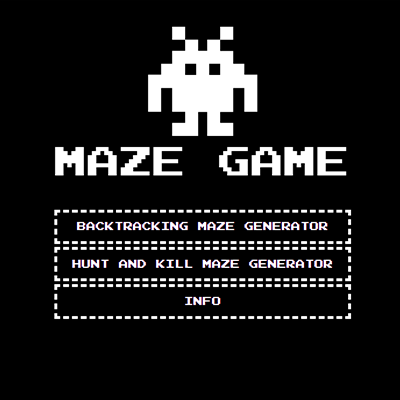

# Maze-game
### _School project 3/5_
The game is basically a representation of the operation of four different algorithms.
The game is basically a representation of the operation of four different algorithms. Two algorithms 
(hunt and kill and backtracking) generate the maze and the other 
two (A * and random) find their way out of the maze.

This project was created with HTML5, CSS3, JavaScript (libraries P5.js, SweetAlert2).

